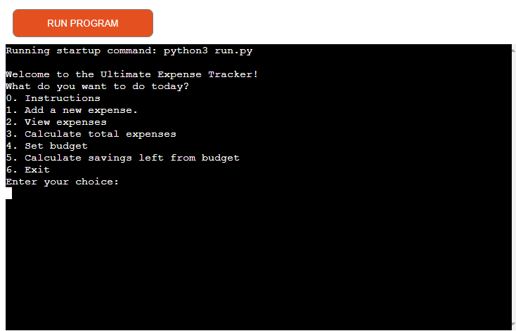
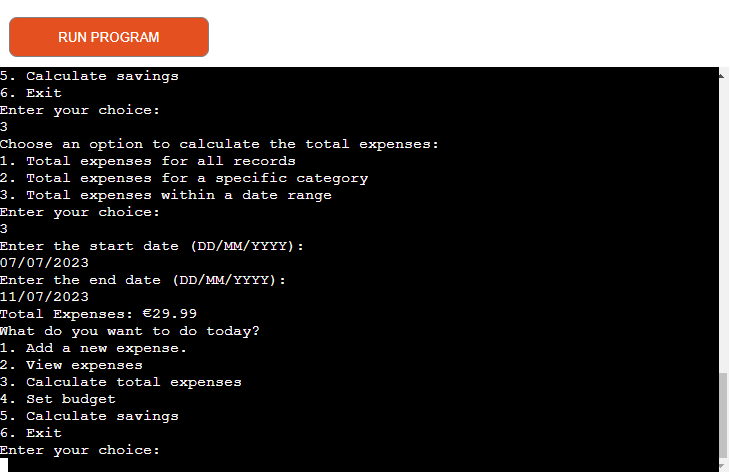

# Ultimate Expenses Tracker

Ultimate Expenses Tracker is a Python command line application designed to help individuals track their expenses and manage their finances effectively. The application allows users to record their expenses, view expense details, calculate total expenses, set budgets, calculate savings, and more.

[View the live project here](https://ultimate-expenses-tracker-6b936149548d.herokuapp.com/)



# Table of Contents
- [Project Background](#project-background) 
- [Features](#features)
  - [Features To Implement](#features-to-implement)
- [Technologies Used](#technologies-used)
- [Testing](#testing)
  - [Validator](#validator)
- [Bugs/Issues](#bugsissues)
  - [Fixed](#fixed)
  - [Unfixed](#unfixed)
- [Deployment](#deployment)
  - [Fork and Clone](#fork-and-clone)
- [Credits](#credits)
- [Acknowledgements](#acknowledgements)

# Project Background

Managing personal finances and keeping track of expenses are essential for maintaining financial health and achieving financial goals. The Ultimate Expense Tracker provides a user-friendly interface for individuals to easily record and analyze their expenses, empowering them to make informed financial decisions.

The project leverages Python and Google Sheets integration to store and manage expense data. By utilizing the gspread library, the application interacts with Google Sheets to store expense records securely in the cloud. This approach provides flexibility and accessibility, enabling users to access their expense data from multiple devices and collaborate with others if needed.

The Ultimate Expense Tracker offers features such as:

Adding new expenses: Users can enter expense details, including the date, name, amount, and category, using a user-friendly interface.
Viewing expenses: Users can view their expenses either for a specific time period, category, or all records, helping them gain insights into their spending patterns.
Calculating total expenses: The application allows users to calculate the total expenses for a given time period or specific expense category, enabling them to monitor their spending and stay within budget.
Setting budgets: Users can set monthly budgets for different categories, helping them track their spending against the predefined limits.
Calculating savings: The application helps users calculate their savings by analyzing their expenses and budgets, providing valuable insights into their financial progress.
The Ultimate Expense Tracker is a flexible and customizable solution that can be extended to meet specific requirements. It provides a solid foundation for individuals to track and manage their expenses efficiently, ultimately leading to improved financial management and better control over personal finances.

# Features

## Menu


The application starts with a menu where the user is presented with different options:
0. Instructions
1. Add a new expense
2. View expenses
3. Calculate total expenses
4. Set budget
5. Calculate savings left from budget
6. Exit

The menu is easy to use and each option explains to the user exactly what the application is offering.

## Intructions


Provide users with instructions on what can be achieved with every options of the menu. 

## Add a new expense


When selecting the add expense option the user is prompted to enter the date, the name, amount and category for the expense that he wishes to add. Once the expense is saved into the Google Sheet the user will get a message with a recap of the details of the expense that was just entered and a confirmation message of the succesful saving of the new expense.
At this point the user is presented again with the main menu.

## View expenses


When selecting the view expense option the user can decide to review all the expenses that were ever logged, the expenses for the current month, the expenses for the current day or for a particular category.The user is then return with a detailed summary of the expenses entered including the date, name, amount and category.

## Calculate total expenses



When selecting the calculate expenses option the user can decide if have a sum of all the expenses that were ever entered, a sum of all the expenses for a particular category or the expenses with a certain date range.
According to the option chosen, the user will be prompted to either enter a category or a date range and he will then be returned with the total of the expenses for that period or category.

## Set budget


In this part of the application the user can set a budget for a certain month. 

## Calculate savings left from budget


The user can review the savings for a certain month or if he wasn't able to stick to the budget he will get the figure of how much he overspent by.

## Features To Implement

- Allow the user to have multiple savings goals. For example: holidays, car, rainy days funds. 
- Allow user to edit or delete expenses in the "View Expenses" menu.
- Set a warning when adding new expenses if getting too close to the budget limit for the month.

# Technologies Used 

- [Python](https://docs.python.org/3/) - is the main language of the application
- [Gitpod](https://gitpod.io/) - to write the code.
- [Github](https://github.com/) - to store the repository of the website.
- [Heroku](https://dashboard.heroku.com/apps) - to deploy and host the application


# Testing

  |Action | Expected behavious | Result|
  |-------|--------------------|-------|
  | Open the link in the browser | The mock terminal open with the main menu | Pass |
  | Enter 1: Add a new expense | The terminal asks input from the user to add a new expense | Pass |
  | Save the new expense |  The new expenses added are correctly saved on Google Sheet | Pass |
  | Enter 2: View expenses | The user is presented with an additional menu asking what expenses they would like to view | Pass |
  | Check this month expenses | Only the current month expenses are shown | Pass |
  | Check today expenses| Only current day expenses are shown | Pass |
  | Check expenses by category | Only expenses for the selected category are shown | Pass |
  | Enter 3: Calculate Total Expenses | The user is presented with a new menu asking what expenses they want to know the total for | Pass |
  | Get total expenses by category | Only expenses for the selected category are added | Pass |
  | Get total expenses by date range | Only expenses for the selected timeframe are added togheter | Pass |
  | Enter 4: Set a budget | User is prompted to enter month and amount, and the data get saved on Google Sheet | Pass |
  | Enter 5: Calculate Savings | After inputting the month, the user is present with the savings for the chosen month according to a previously setted budget. The savings amount is saved on Google Sheet. | Pass |
  | Enter 6: Exit | The user is presented with the goodbye message and the application stops running. | Pass |
  | Input incorrect date format or something that is not a number | User gets an error message and is prompted to enter the information again | Pass |
  | Input incorrect option for category | User gets an error message and is prompted to enter the information again | Pass |
  -------

## Validator


No issues were dected when passing the code through the CI Python Linter

# Bugs/Issues

## Fixed

- When calculating the savings I first encountered some issues reading the expenses for the same month as the dates were inputted in a different format. For example, in the expenses_tracker the dates are set at DD-MM-YYYY while on the budget sheet I only have the month as MM. I was able to fix this, by using this piece of code  and the zfill() method. 

```
budget_amount = sum(
        record["Amount"]
        for record in budget_records
        if str(record["Month"]).zfill(2) == month
    )
```

## Unfixed

- When setting up a budget, at the moment the user can setup multiple budgets for the same month and on the Google Sheet this creates a new entry each time. Instead of having one line for all the budget entries for July, I have multiple entries for the budget for that same month. I wasn't able to get the function to delete all rows with the same month, but just the first one if there were more than one. The exact same issue happens with the Savings sheet.

# Deployment

The project was deployed using Heroku following these steps:

  - Create an Heroku account
  - Click on Add App
  - Go to Settings > Config Vars
  - Add the config KEY and VALUE provided by Code Institute, in order to be able to use the template provided for this project
  - Click on add buildpack to add python and nodejs
  - Go to deploy tab
  - Select GitHub as deploy method
  - Select the relevant GitHub repository
  - Click on deploy branch

The live link can be found here - [Live Application](https://ultimate-expenses-tracker-6b936149548d.herokuapp.com/).

## Fork and clone

### To fork the repository on GitHub

A copy of the GitHub Repository can be made by forking the GitHub account. Changes can be made on this copy without affecting the original repository.

1. Log in to GitHub and locate the repository in question.
2. Locate the Fork button which can be found in the top corner, right-hand side of the page, inline with the repository name.
3. Click this button to create a copy of the original repository in your GitHub Account.

### To clone the repository on GitHub

1. Click on the code button which is underneath the main tab and repository name to the right.
2. In the 'Clone with HTTPS' section, click on the clipboard icon to copy the URL.
3. Open Git Bash in your IDE of choice.
4. Change the current working directory to where you want the cloned directory to be made.
5. Type git clone, and then paste the URL copied from GitHub.
6. Press enter and the clone of your repository will be created.

# Credits

- Setup of API and access to Google Sheet was made following "Love Sandwich" videos from Code Institute.
- gspred documentation(https://docs.gspread.org/en/v5.9.0/) 
- google-auth documentation(https://google-auth.readthedocs.io/en/master/)
- How to Validate Date and Time Strings(https://datatest.readthedocs.io/en/stable/how-to/date-time-str.html)
- General idea and basic setup inspired by Youtube video "Learn Python • #12 Final Project • Build an Expense Tracking App!"(https://www.youtube.com/watch?v=HTD86h69PtE&t=3073s)


# Aknowledgments

Once again, thanks to my brother [Davide](https://github.com/Dave0x21) for all his insights on the best ways to write Python codes. 
